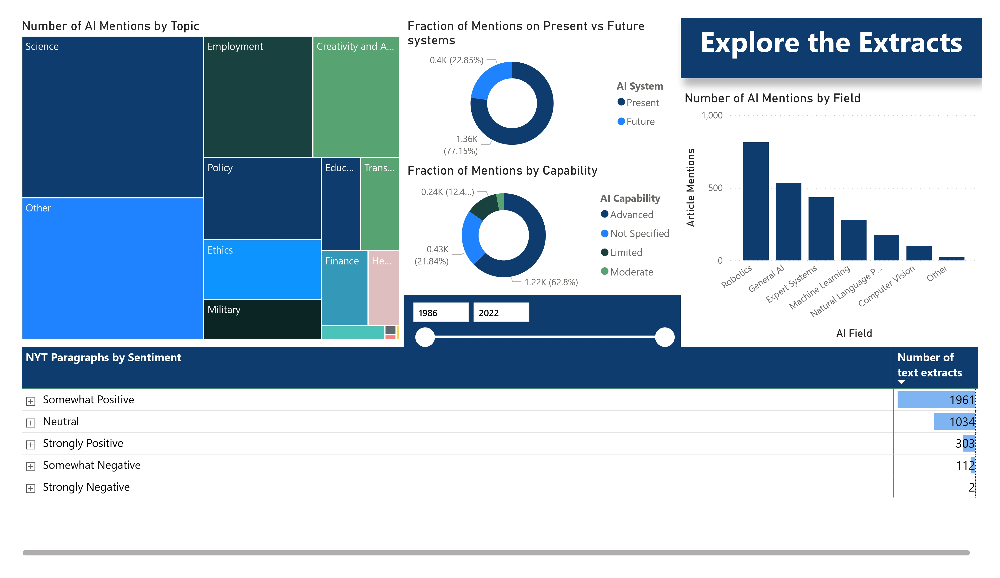
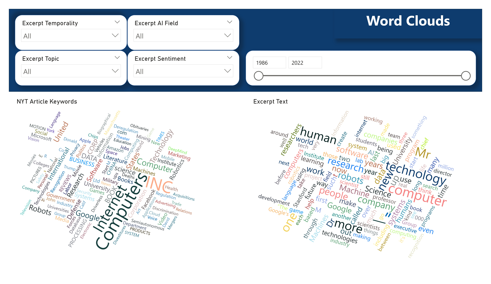
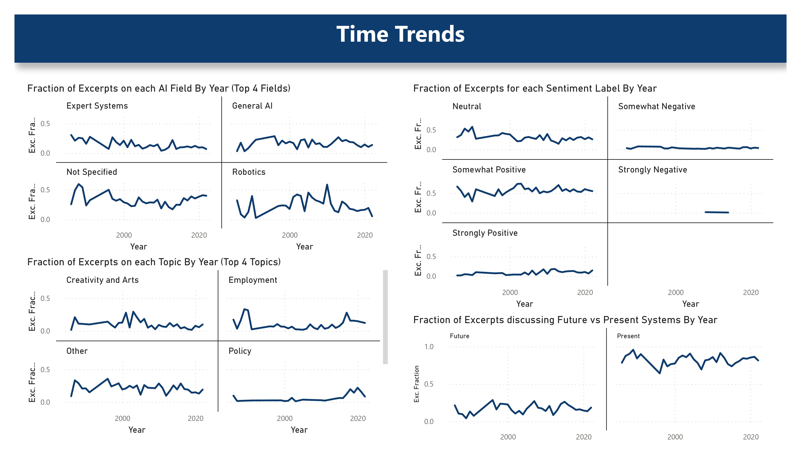

# Long-Term Trends in the Public Perception of Artificial Intelligence

This project analyzes the evolution of public perception of AI over the last 35 years by scraping, processing, labeling, and plotting data from New York Times articles. It builds upon the [2017 analysis by Ethan Fast and Eric Horvitz](https://arxiv.org/abs/1609.04904) and introduces several improvements:

* Reduces the cost of labeling articles by 100x using LLMs instead of human annotators
* Includes additional labels on application realm, assessed level of AI capabilities, article keywords, and AI fields
* Extends the timeframe to 2023, providing an up-to-date view on AI trends
* Introduces a Power BI dashboard for visualizing, filtering, and exploring articles and trends
* Uses asyncio to parallelize article scraping and labeling, as well as individual API calls to the same provider, minimizing running time within API rate limits

Although Power BI dashboards cannot be shared online without a Pro account, you can download the project from the dashboard folder and open it with the free Power BI Desktop application on your computer. The dashboard enables you to filter and explore articles by year, topic, application realm, and AI field, and to visualize trends in the public perception of AI over time.

